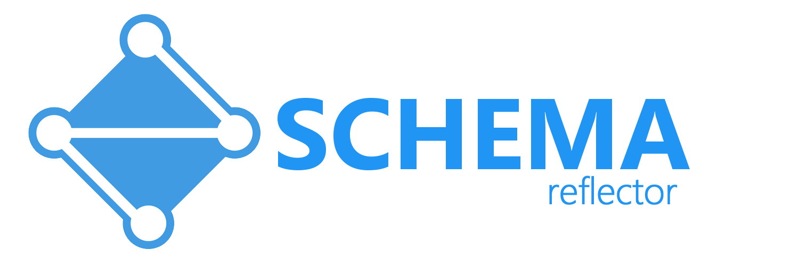
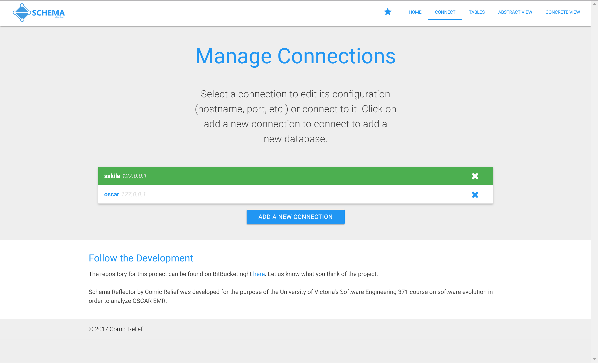
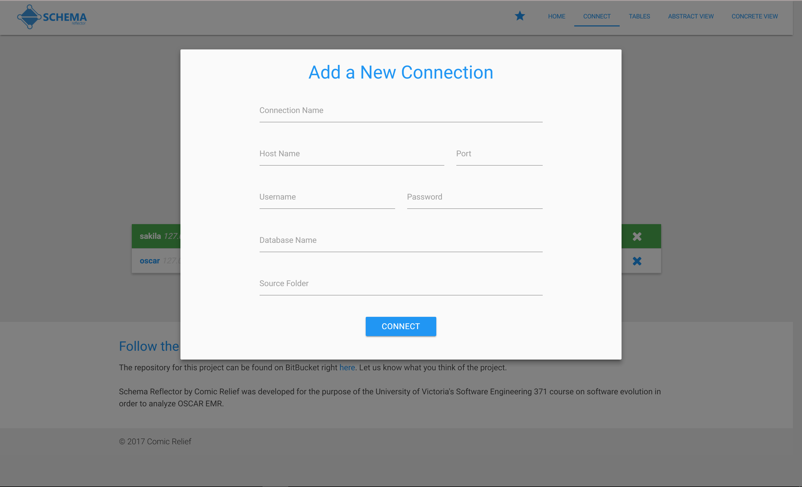
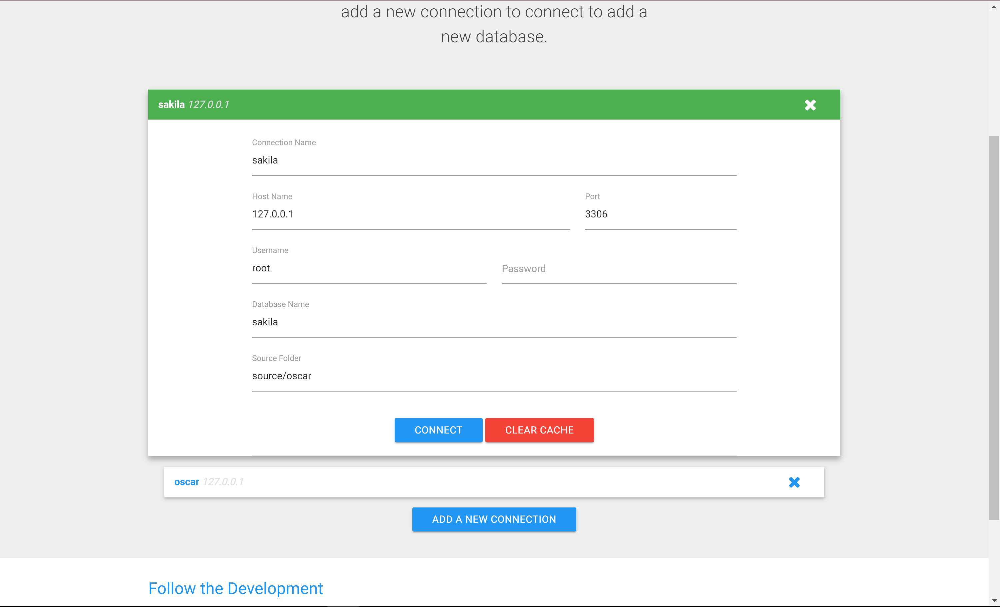
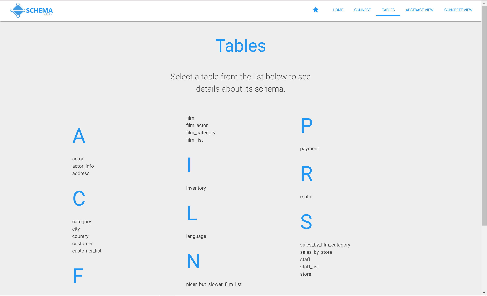
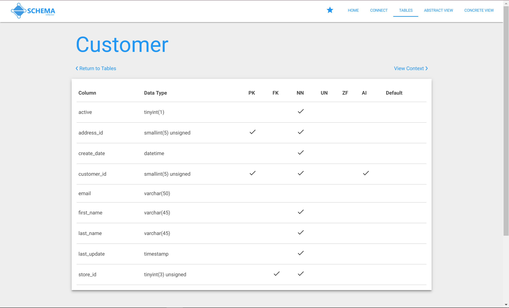
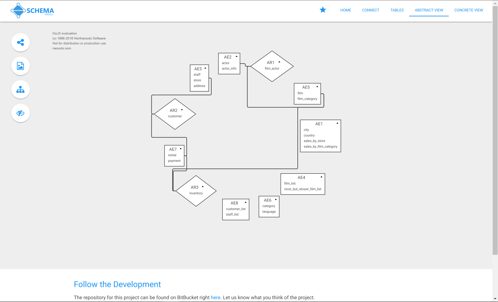
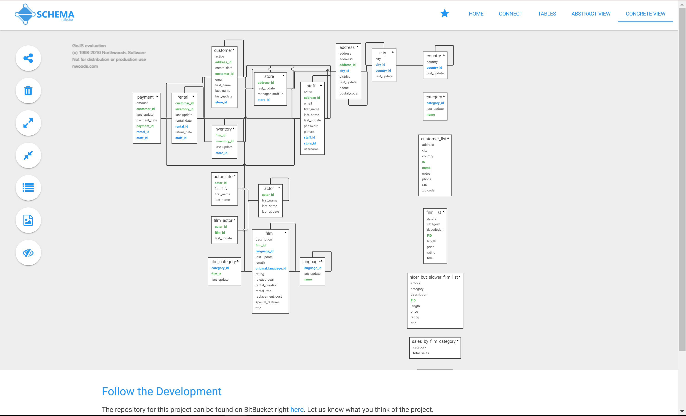

Schema Reflector is a database analysis tool built for the software package
OSCAR EMR. It offers generic analysis capabilities for any MySQL database
that allows users to view diagrams and details of a schema. It has been
developed as part of the University of Victoria's Software Engineering 371
course on software evolution.

## Introduction

### Dependencies

In order to get Schema Reflector off the ground you will need:

 - [git](https://git-scm.com/)
 - [Node.js](https://nodejs.org/en/)
 - A modern broswer ([chrome](https://www.google.com/chrome/browser/desktop/index.html) or [firefox](https://www.mozilla.org/en-US/firefox/products/))

### Installation

To install Schema Reflector you will need to clone this repository into a
directory on your machine. You can do this by running the command:

```
$ git clone https://github.com/ejrbuss/schema-reflector
```

### Running Schema Reflector

To start Schema Reflector on you machine first navigate the project root
directory in a shell and run:

```bash
$ npm install
```

This will install all the necessary node dependencies. This only has to be
run the first time you run the app. After this you can
start the app using:

```
$ npm start
```

By default this will start Schema Reflector on port `8080`. To change the
port number you can either edit the config section of `package.json` or
run the app directly and pass a port argument with:

```
$ node app.js -p <port number>
```

To access the app go to `localhost:8080` on your web browser.

## Connecting to Your Database

In order to connect to your database click the **connect** navigation
header at the top of the app home page. This should open the connection
management page:



Here you can edit connections you already have as well as add new ones. By
default there will be at least one connection already configured. If a
database is unable to connect it will use backup data from a snapshot
of OSCAR EMR included with this application for demonstration purposes. To
configure your own database click the **Add a New connection Button** to
open a form:



Here you can enter your database configuration information and
connect to it. If the connection was succesful, it will appear in the
connection list in green. If the connection could not be made it will
appear in red.

### When to Clear the Cache

When modifying a connection you can either "Connect" or "Clear Cache". Both
of these actions will conect your database.



Because MySQL reflection is slow we cache all database requests as well as
any changes you make to diagrams within Schema Reflector. If your database
has changed, you want to use the same connection to connect to a different
database, or you want to delete any changes you have made to diagrams you
should use the **Clear Cache** option. In all other cases **Connect** is
sufficient.

## Link Java Source

Schema Reflector supports Foreign Key Candidate interpolation from `.java`
source code. This process assumes there is additional implicit foreign key
data encoded in JPA annotations.

To use this feature set the `source` field of your connection to point to
a project's source directory. The path provided can either be relative to
Schema Reflector's install directory or be an absolute path.

## Using the Application

Schema Reflector provides 3 primary views on a database schema, the *table
view*, the *abstract view*, and the *concrete view*.

### Table View

The *table view* provides a listing of all tables in a schema in alphabetic
order. This view also provides quick access to viewing all of the columns
in a particular table.



After clicking a table you will be showed all of the column details for the
given tables. Additionally you can press *View Context* to see the
*concrete view* containing this table.



### Abstract View

The *abstract view* uses an algorithm described
[here](http://www.sciencedirect.com/science/article/pii/S0167642302000576)
to cluster tables into abstract entities and relations. This can be a useful
view for trying to gain a high level understanding of a monolithic piece of software.



This view can be navigated with the mouse to translate the diagram as well
as the scroll wheel to zoom in and out. Entities and relationships can be
moved by dragging and renamed by double clicking their titles. Along the
left hand side of the view are a set of control tools. They have the
following purposes:

 - Change Layout
 - Export Image
 - Drill Down Selected
 - Toggle all Attributes

These descriptions are viewable in app by hovering your mouse over the
respective tool's icons.

Using the drill down action allows you to view the concrete entities
(tables) contaiend by a single abstract entity or abstract relation. When
in this sub view **Drill Down Selected** is replaced with a "Drill Up" tool.

### Concrete View

Concrete view provides an Entity Relationship Diagram for your whole
database. It provides tools for manipulating the diagram to find useful
subsets of tables.



In addition to explicity defined foreign keys in the schema, Schema
Reflector also provides the means to find implicit foreighn keys based off
java source code. These foriegn keys and their relations appear in a
different accent color than regular foreign keys that appear in green. Along
the left hand side of the view are a set of control tools. They have the
following purposes:

 - Change Layout
 - Show Removed Entities
 - Expand Selected
 - Focus Selected
 - View Table Details
 - Drill Down Selected
 - Toggle all Attributes

These descriptions are viewable in app by hovering your mouse over the
respective tool's icons.

## Editing Configuration Files

In addition to using Schema Reflector's Connection page to edit
configuration settings, config files can be accessed and edited manually. They can be found in
`connections/configurationName/config.json`. This file
contains a JSON object representing your configuration.
As an example:

```JSON
{
    "dir": "default",
    "name": "sakila",
    "host": "127.0.0.1",
    "port": "3306",
    "user": "root",
    "password": "",
    "database": "sakila",
    "source": "source/sakila"
}
```

You will have to restart Schema Reflector after manually editing its
configuration.

## Resources

Schema reflector includes with it copies of the OSCAR EMR schema. OSCAR
ERM is open source software available online at
[github](https://github.com/scoophealth/oscar). Additionally Schema
reflector includes a copy of the Sakila database JPA example codebase
made avaiable [here](https://github.com/saltnlight5/java-ee6-examples).
The team behind Schema Reflector is thankful to all providers of open
source software.